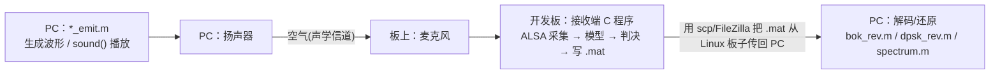

# 工程文档 · 总览与导航

本目录集中存放工程的全部说明文档（之前散落在各子目录的 README 已汇总到这里）。

## 文档导航

| 文档 | 内容 |
|---|---|
| 本文（`README.md`） | 工程总览：架构、运行条件、共享底层、构建总览、重新生成模型 |
| [`实验一_单频信号.md`](实验一_单频信号.md) | 实验一逐目录文件说明 + 用法 |
| [`实验二_DPSK.md`](实验二_DPSK.md) | 实验二逐目录文件说明 + 差分编码/成形/多图自适应 + 用法 |
| [`实验三_chirp扩频.md`](实验三_chirp扩频.md) | 实验三逐目录文件说明 + 多速率/多图自适应 + 用法 |
| [`手把手部署运行教程.md`](手把手部署运行教程.md) | **从零到实测的分步操作**：传代码上板 → 编译 → 声学实测 → 取回解码 |
| [`Q&A.md`](Q&A.md) | **常见问题与坑点**（声卡设备、跨板差异、编译、MATLAB 代码生成） |

> 项目根目录的 `README.md` 只做**简要介绍 + 许可声明**；细节都在本目录。

---

## 这是什么

一套 Simulink 声学软件无线电教学工程，接收端在**任意 Linux**
（x86 / 树莓派 / Jetson / 香橙派 / 其它 ARM 板）上用 `gcc` 直接编译运行。

**运行条件**：任意 Linux + `libasound`(ALSA 用户态库) + `pthread` + `gcc`，
**不需要 MathWorks 硬件支持包**。
**与具体板子无关**——平台差异只剩一个命令行参数 `-d <声卡设备名>`。

## 整体架构：非对称「PC 发射 + 板端接收」

三个实验都是同一种结构——**`.slx` 模型只是接收端**，发射是 PC 端 MATLAB 脚本：



- **发射端**（`*_emit.m`）：纯 PC MATLAB，用 `sound()` 经声卡播放。
  实验二/三的 `py/` 下另有一套**在板上跑的** Python 脚本（`*_emit.py`/`*_rev.py`），
  板子只要有 python3 就能脱离 MATLAB 把整个实验跑完。
  三个实验各有一个可选的 `gui.m`，把「连接/枚举采集设备 + 同步源码上板并编译 +
  电平校准 + 启动采集/放音/取回/解码」串成四次点击（手动流程仍是教学正路，
  见 [Q&A](Q&A.md) Q9）。
- **接收端**（板上 C）：Simulink 只负责生成**纯算法 C**，音频 I/O、
  落盘、调度全部由手写的 POSIX/ALSA 代码（`common/`）承担。
- **取文件**：接收端把 `.mat` 写到板上本地盘，用标准 **`scp`/FileZilla** 拉回 PC。

## 顶层目录结构

```
.
├── README.md            根说明（简介 + 许可）
├── LICENSE              GNU GPLv3
├── documents/           ← 本文档目录
├── common/              跨实验共享：板级底层(音频 I/O + MAT 写入) + matlab/(GUI 共用层)
├── exp1_single_freq/    实验一 · 单频信号测试
├── exp2_dpsk/           实验二 · DPSK 差分相移键控
└── exp3_chirp/          实验三 · 线性调频(chirp)扩频通信

每个实验目录是扁平的，只有 `src/`（手写 C）和 `py/`（板上脚本）两个子目录，
`.slx` 与各 `.m` 脚本都在根下：

    exp2_dpsk/
    ├── Makefile             板上构建入口
    ├── dpsk_receive.slx         Simulink 模型（只在 PC 上打开，不上板）
    ├── dpsk_receive_ert_rtw/    模型生成的 C（可整个删掉重生成）
    ├── src/                 手写 C：main.c  model_glue.c  model_iface.h
    ├── py/                  免 MATLAB 的板上发射/解码脚本
    ├── dpsk_emit.m  dpsk_rev.m  gui.m  setup_paths.m
    ├── sample_data/         离线试解码用的样例
    └── baseband_images/     基带图片，MATLAB 与板上 py 都读它（实验一无此项）
```

## 共享底层 `common/`

三个实验共用的板级运行时，全部手写 POSIX，零支持包依赖：

| 文件 | 作用 |
|---|---|
| `include/audio_io.h`、`src/audio_io.c` | POSIX/ALSA 采集+播放（S16_LE，设备/速率/声道/帧长可配，`snd_pcm_recover` 处理 xrun） |
| `src/audio_io_null.c` | 合成 1kHz 单音后端（无声卡机器联调，编译开关 `AUDIO=null`） |
| `src/audio_io_file.c` | 原始 int16 文件输入后端（无噪声链路验证，`AUDIO=file`） |
| `include/mat_sink.h`、`src/mat_sink.c` | MAT-v4 流式写入器，产出与 Simulink `To File` 同格式的 `.mat` |
| `matlab/+asdr/` | 三个 `gui.m` 共用的界面骨架与板上连接层（`App` / `Board` / `ImageUI`），**跑在 PC 上，不上板** |

平台差异收敛到一个参数 `-d`；唯一耦合 Simulink 符号名的代码集中在各实验
`src/model_glue.c`（重新生成模型后只需核对一处字段名）。

## 三个实验对照

| 实验 | 模型 | 功能 | 帧率 | 接收端可执行 |
|---|---|---|---|---|
| [实验一](实验一_单频信号.md) | `single_fre_rev.slx` | 声学单频接收/滤波/记录 | 100Hz 单速率 | `sdr_rx` |
| [实验二](实验二_DPSK.md) | `dpsk_receive.slx` | DPSK 接收：滤波/码元同步/抽样判决 | 100Hz 单速率 | `dpsk_rx` |
| [实验三](实验三_chirp扩频.md) | `chirp_rev_detect.slx` | LFM 扩频接收检测（多速率 + 15 个 Stateflow） | 10Hz 多速率 | `chirp_rx` |

## 构建总览（两个独立开关 MODEL / AUDIO）

每个实验目录下：

```bash
make                       # 真实模型 + ALSA      —— 板上部署（需 libasound2-dev）
make AUDIO=null            # 真实模型 + 合成音频   —— 无声卡机器验证算法
make AUDIO=file            # 真实模型 + 文件输入   —— 无噪声链路验证（喂 .raw）
make MOCK=1                # 桩模型 + 合成音频     —— 纯管线/调度联调
```

安装 ALSA 开发库：Debian/Ubuntu/树莓派/香橙派/Jetson `sudo apt install libasound2-dev`；
Fedora `sudo dnf install alsa-lib-devel`。交叉编译：`make CC=aarch64-linux-gnu-gcc`。

## 重新生成模型（改算法后，需 MATLAB）

`.slx` 与它生成的 C 代码（`<模型名>_ert_rtw/`）已一起入库，**运行端不需要 MATLAB**。
只有当你要改算法时才需要在 MATLAB 里重新生成：配置 `ert.tlc` + `HardwareBoard=None`
+ `GenCodeOnly` + 关 MAT 日志 + `Toolchain` 设为自动定位，`slbuild` 直接覆盖
`<模型名>_ert_rtw/`，再 `make` 即可。Device Type 已设为 `ARM Cortex-A (64-bit)`。
入库的 `.slx` 存的是 **R2022a 格式**，R2022a 及以上都能打开；在更高版本改完模型
提交回来前要用 `Simulink.exportToVersion(..., 'R2022A')` 导出回去（见 [Q13](Q&A.md)）。
**生成代码不需要宿主机装任何 C 编译器**（编译在板上做），MATLAB 提示找不到
supported compiler 可以无视。详细步骤见各实验文档；踩坑见 [Q&A](Q&A.md)。

## 致谢与许可

见根目录 `README.md`。本工程基于一套现成的树莓派 + Simulink 声学 SDR 教学工程改写
（原工程未声明许可证）；新增/改写的代码以 **GNU GPLv3** 发布。
