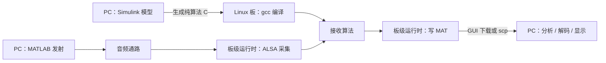

# 工程文档 · 总览与导航

本工程用声音传输单频信号或图片：PC 负责生成信号与显示结果，Linux 开发板负责采集音频、运行接收算法并记录数据。五个实验共用音频、写盘和 GUI 基础代码。

## 从哪里开始

1. 按[构建与部署](构建与部署.md#准备环境)准备 PC、开发板和音频通路。
2. 在 PC 生成模型 C，上传到板上编译。
3. 先跑通[实验一](构建与部署.md#实验一)，看到约 1000 Hz 的频谱峰值。
4. 再按教程切换图片实验，观察 BER、还原点阵和星座图。

## 按任务查文档

| 你要做什么 | 文档 |
|---|---|
| 从裸工程生成 C、命令行部署、MATLAB 收发与分析 | [构建与部署](构建与部署.md) |
| 修改模型后重新生成、编译和回放 | [构建与部署 · 重建](构建与部署.md#重新部署) / [文件回放](构建与部署.md#文件回放) |
| 查默认参数、命令行、MAT 格式和目录用途 | [接口与参数参考](接口与参数参考.md) |
| 处理编译、音频、帧同步或星座异常 | [常见问题 Q&A](Q&A.md) |

| 实验原理 | 主要学习内容 |
|---|---|
| [实验一 · 单频信号](实验一_单频信号.md) | 采样、滤波和 FFT，检查完整收发通路 |
| [实验二 · DPSK](实验二_DPSK.md) | 差分编码、脉冲成形、码元同步和帧同步 |
| [实验三 · chirp 扩频](实验三_chirp扩频.md) | 上下扫频、相关检测和多速率接收模型 |
| [实验四 · V.22bis](实验四_V22bis.md) | QPSK/16-QAM、匹配滤波、定时与载波恢复、HDLC/FCS |
| [实验五 · SSTV](实验五_SSTV.md) | Martin / Scottie / Robot / PD 等 20 种模式、VIS 模式识别、二值/彩色逐行扫描、鉴频与图像质量 |

## 工程如何分工

模型负责算法，手写 C 负责音频设备、调度和文件。二者由各实验的 `src/model_glue.c` 连接；共享实现位于 `common/`。开发板不运行 MATLAB，也不需要 MathWorks 硬件支持包。

音频通路既可以是扬声器到麦克风，也可以是兼容电平的线路输出到线路输入。有线结果与空气传播结果应分别记录，不能用一种通路的结果替另一种通路验收。

从新克隆的仓库构建真实接收机，需先在 PC 生成模型 C；运行时由板上 C 程序接收，PC 上的 MATLAB 脚本或 GUI 完成发送与解码。环境要求见[软件与版本](接口与参数参考.md#软件与版本)。

## 文件与记录的边界

仓库保存模型、手写源码、实验图片和正式说明；生成 C、构建缓存和采集产物不入库。实验四、五的内部函数位于 `private/`，模型算法位于 `model/`，日常入口留在实验根目录。

详细目录见[目录与入口](接口与参数参考.md#目录与入口)。
