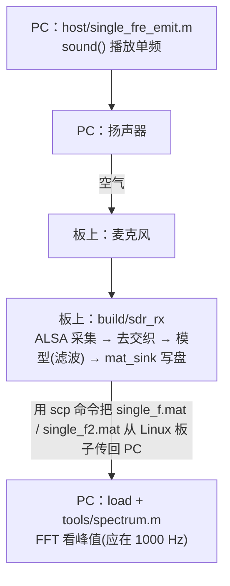

# 实验一 · 单频信号测试

最简单的声学 SDR：PC 扬声器播放一个单频音（默认 1kHz），开发板麦克风采集、
滤波、记录，PC 端做 FFT 验证频谱峰值落在 1kHz。用来打通"发射→声学信道→板端接收→落盘→PC 分析"的整条最小链路。

> 📖 **从零部署到实测的完整分步操作见 [手把手部署运行教程](手把手部署运行教程.md)**（传代码上板 → 编译 → 声学实测 → 取回看频谱）。

## 数据流



## 目录与文件逐一说明

```
exp1_single_freq/
├── Makefile          构建脚本（MODEL/AUDIO 开关；MODEL_DIR 指向生成代码目录）
├── src/              板级运行时（手写，可移植）
├── include/          运行时↔模型 契约
├── matlab/           改造后的 Simulink 模型 + 生成的纯算法 C 代码
├── host/             PC 端 MATLAB 发射脚本
└── tools/            PC 端分析脚本
```

### `src/` — 板级运行时（取代支持包 + `ert_main.c`）

| 文件 | 作用 |
|---|---|
| `main.c` | 主循环：ALSA 采集一帧 → 去交织 → 喂模型 `model_step()` → `mat_sink` 落盘。ALSA 阻塞读天然提供 100Hz 节拍。命令行 `-d/-t/-c/-r/-p`。 |
| `model_glue.c` | **唯一**耦合 Simulink 符号名的薄层：把采集缓冲映射到 `single_fre_rev_U.AudioIn`、把 `single_fre_rev_Y.out_f1/out_f2` 取出。 |

（音频 I/O `audio_io*.c`、写盘 `mat_sink.c` 在 `../common/`，见总览。）

### `include/`

| 文件 | 作用 |
|---|---|
| `model_iface.h` | 运行时与生成代码之间的契约：采样率、帧长、声道数、`model_init/step/term` 等声明。 |

### `matlab/` — 模型与生成代码

| 文件 | 作用 |
|---|---|
| `single_fre_rev.slx` | 改造后的接收模型（适配当前 MATLAB）。 |
| `single_fre_rev_ert_rtw/*.c/.h` | Simulink 生成的**纯算法 C 代码**（无任何支持包/rt_logging 依赖）。Makefile 直接读取该目录，无需手动拷贝。 |

**模型相对原树莓派版的改造**：
1. `ALSA Audio Capture` 块 → **Inport `AudioIn`**（`int16`，`[80 2]`，去交织布局 `[L0..79, R0..79]`）。音频采集移出模型，由板级 POSIX 代码喂入。
2. 两个 `To File` 块 → **Outport `out_f1` / `out_f2`**（`double[80]`）。输出移出模型，由板级 `mat_sink.c` 写 `.mat`。
3. 配置：`System target file = ert.tlc`，`Hardware board = None`，`Language = C`，`GenCodeOnly = on`，`MatFileLogging = off`（避免 `To File` 拖入 `rt_logging`，见 [Q&A](Q&A.md)），`Device Type = ARM Cortex-A (64-bit)`。

### `host/` — PC 端发射

| 文件 | 作用 |
|---|---|
| `single_fre_emit.m` | 发射端：生成单频（默认 `fc=1000`，可改）→ `sound()` 经扬声器播放；含双频叠加/前后发送的注释变体。 |

### `tools/`

| 文件 | 作用 |
|---|---|
| `spectrum.m` | 读回 `single_f.mat`，做 FFT 看频谱峰值（验证是否落在 1kHz）。 |

## 构建与运行

```bash
cd exp1_single_freq
make                       # 真实模型 + ALSA（板上，需 libasound2-dev）
make AUDIO=null            # 真实模型 + 合成 1kHz（无声卡机器验证算法）
make MOCK=1                # 桩模型 + 合成音频（纯管线/调度联调）

arecord -l                 # 先看麦克风是 card 几
./build/sdr_rx -d plughw:2,0 -t 5     # 采集 5 秒（card 号按实际改）
```

产出 `single_f.mat`(变量 `toFileData`) 与 `single_f2.mat`(`toFileData2`)，均为
81×N double（第 1 行时间，其余 80 行样本），与原工程 / PC 端 GUI 的 `load(...)` 兼容。

> 设备名 `-d`、`default` 报错、单声道默认 `-c 1` 等问题统一见 [Q&A](Q&A.md)。

## 发射与取文件

- **发射**（PC，MATLAB）：`single_fre_emit` 一台机器扬声器播放单频信号。
- **取文件**：`mat_sink.c` 把 `single_f.mat` 写到板上本地盘，`scp` 拉回 PC：
  ```bash
  scp <用户>@<板子IP>:~/.../single_f.mat .
  ```
  再 `load` + `tools/spectrum.m` 看频谱。

## 重新生成模型（改算法后）

两种等价方式，产物都落到 `single_fre_rev_ert_rtw/`，任选其一。

### 方式 A：脚本（`slbuild`，可批处理）

```matlab
cd <exp1_single_freq/matlab>
load_system('single_fre_rev')
% …如需改算法在此修改…
set_param('single_fre_rev','SystemTargetFile','ert.tlc');
set_param('single_fre_rev','HardwareBoard','None');
set_param('single_fre_rev','GenCodeOnly','on');
set_param('single_fre_rev','MatFileLogging','off');
slbuild('single_fre_rev');     % 代码直接生成到 single_fre_rev_ert_rtw/
```

### 方式 B：Simulink 界面（GUI，更直观）

GUI 方式就是把上面 `set_param` + `slbuild` 用菜单点出来，产物完全一致。

1. 打开 `single_fre_rev.slx`。
2. 顶部 **APPS → Embedded Coder**，工具条出现 **C CODE** 选项卡。
3. `Ctrl+E` 打开 **Configuration Parameters**，对齐下表（与方式 A 一一对应）：

   | 面板 | 选项 | 设成 |
   |---|---|---|
   | Code Generation | System target file | `ert.tlc`（Browse 选 Embedded Coder） |
   | Hardware Implementation | Hardware board | `None` |
   | Hardware Implementation | Device vendor / type | `ARM Compatible` → `ARM Cortex-A (64-bit)` |
   | Code Generation | Language | `C` |
   | Code Generation | ☑ Generate code only | 勾上 |
   | Code Generation → Interface | MAT-file logging | **取消勾选**（否则拖入 `rt_logging.c`，见 [Q&A](Q&A.md)） |

4. **OK / Apply** 保存配置。
5. 模型窗口按 **`Ctrl+B`**（或 **C CODE → Generate Code**）生成，结束后自动弹出
   Code Generation Report 可逐文件查看。

回到 `exp1_single_freq/` 直接 `make`。生成目录里的 `.mk/.mat/html/tmwinternal`
是缓存，已被 `.gitignore` 忽略。若重新生成后 Inport/Outport 名字变了，只需同步
改 `src/model_glue.c` 这一处。
