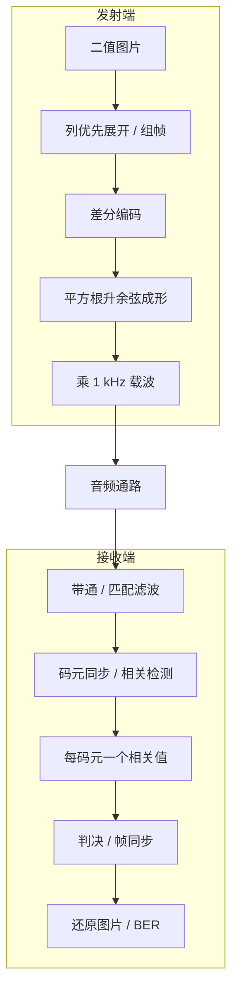

# 实验二 · DPSK 差分相移键控

本实验把二值图片按列展开为比特，以相邻码元的相位变化携带信息，经过脉冲成形后调制到 1 kHz 载波。开发板输出逐码元的相关值，PC 或板上 Python 脚本完成帧同步、图片还原和 BER 计算。

操作步骤见[部署运行教程 · 实验二](手把手部署运行教程.md#实验二)；默认值和文件格式见[接口与参数参考](接口与参数参考.md)。

## 系统模型

## 发送模型如何组织信号链

`dpsk_transmit.slx` 由五个分立模块组成：**前导与图片组帧 → 差分编码 → 每符号插零扩展 → 平方根升余弦成形 → 载波调制**。输入是图片按列展开的 0/1 比特；前导、首尾 m 序列和保护码元由模型生成。

`dpsk_emit` 与 GUI 共用 `dpsk_modulate`，默认运行 `private/dpsk_modulate_matlab.m` 中的 MATLAB 算法。选择 Simulink 发送时，通过 `Simulink.SimulationInput` 设置图片数据并调用 `sim`。模型每步处理一个符号，输出 80 点；发完后继续冲洗滤波器，MATLAB 保留完整拖尾，再按整段峰值归一化并播放。帧结构、成形系数和载波与下面的原理一致，发送过程不需要 C 代码。

## 差分编码：观察相位变化

设图片组帧后的比特为 $b_k$，差分状态为 $d_k$，初始状态为零：

$$
d_k=b_k\oplus d_{k-1},\qquad a_k=1-2d_k.
$$

发送符号 $a_k$ 取 `+1` 或 `−1`，对应载波相位相差 180°。例如输入 `0,1,1,0` 时，状态为 `0,1,0,0`，发送符号为 `+1,−1,+1,+1`。

信息取决于相邻符号的关系。因此整段信号共同翻转 180° 不会改变差分关系，接收端不必知道发射端的绝对载波相位。噪声、错误抽样和随时间变化的相位仍会造成误码，差分编码本身不提供纠错。

## 成形：限制带宽并控制码间串扰

码元率为 100 Baud，每码元携带 1 bit，采样率为 8000 Hz，每码元有 80 点。发射端先插零上采样，再使用滚降系数 $\beta=0.5$ 的平方根升余弦脉冲成形：

$$
x[n]=\left(\sum_k a_kh[n-80k]\right)
      \sin\left(2\pi\frac{1000}{8000}n\right).
$$

理想的收发平方根升余弦级联得到升余弦响应，在正确抽样时刻满足零码间串扰条件。工程使用有限长度滤波器，实际结果还受定时误差、信道和滤波截断影响，不能把理想条件当成实采保证。

## 组帧：从连续判决流里找到图片

图片以列优先顺序展开，$L=宽\times 高$。帧内各段如下，长度单位均为比特，也就是本实验的码元数：

| 段 | 长度 | 内容与作用 |
|---|---:|---|
| 起始段 | 18 | 全 0 比特，用于接收捕获 |
| 交替段 | 8 | `01010101` |
| 帧头 | 15 | m 序列 `100110101111000` |
| 载荷 | L | 图片像素 |
| 帧尾 | 15 | 与帧头相同的 m 序列 |
| 尾部保护 | 80 | 全 0 比特，让数据通过接收流水线 |

这里的全 0 是**待调制的比特**，仍会产生载波，不能把它当成静音。总长度为 $L+136$ 个码元，另有成形滤波拖尾；默认 512 bit 图片的波形约 6.5 秒。

接收模型含 3200 点、约 40 码元的延迟状态，尾部保护必须给帧尾留下通过流水线的时间。采集窗口还需包含启动和播放等待，不能只取 $L/100$ 秒。

## 判决与图片还原

模型每处理 80 点输出一个相关值，保存到 `dpsk5.mat`。这个值保留幅度信息，可能达到较大量级，**不是已经归一化的 ±1**。解码脚本按整段数据的峰值设门限，再寻找相距 $L+15$ 的两段 m 序列。

本实验的空中帧不携带宽高。MATLAB 解码端从选定 BMP 得到尺寸，从 `info_all.mat` 取得发送真值；Python 解码端从指定 BMP 读取尺寸和真值。换图后，发射与解码必须选择对应图片，板上逐码元处理的模型无需因图片长度变化而修改。

$$
\mathrm{BER}=\frac{\text{恢复像素与发送真值不同的数量}}{L}.
$$

这里没有 FCS 验证和自动重传。找到帧头、帧尾不意味着图片一定无误，仍要检查 BER 和点阵。仓库的 `sample_data/` 保存了一组接收数据和对应真值，可用于练习解码；它不是每次实采都能达到的性能承诺。

## 模型与运行时的关系

模型是单速率：一次 `dpsk_receive_step()` 消耗一帧 80 点音频并输出一个值。默认单声道经运行时复制为两路，由模型相加；求和有整数饱和保护，幅度过大仍会削顶。

MATLAB 和 Python 发射、解码入口见[目录与入口](接口与参数参考.md#目录与入口)。已有生成 C 后，可以按[文件回放流程](构建与部署.md#文件回放)绕过声卡检查数字链路，再与实采结果比较。
