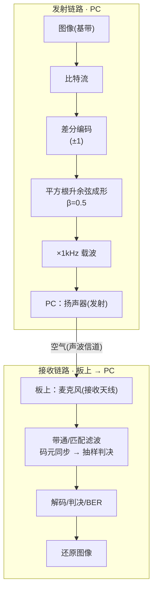
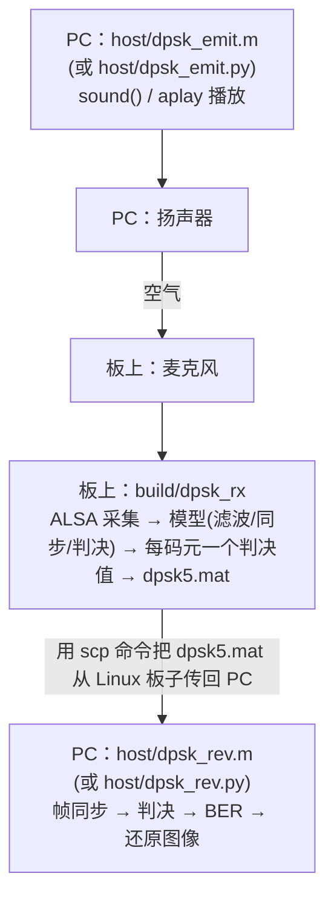

# 实验二 · DPSK 差分相移键控

把一张 1-bit 图片当基带信息，先做**差分编码**，经**平方根升余弦成形**后调制到
1kHz 载波，用扬声器发射；开发板麦克风采集，板上做带通/匹配滤波、码元同步、抽样判决，
每个码元输出一个判决值；PC 端帧同步、判决、算 BER、还原图像。

> 📖 **从零部署到实测的完整分步操作见 [手把手部署运行教程](手把手部署运行教程.md)**（传代码上板 → 编译 → 声学实测 → 取回解码算 BER）。

## 系统模型



- **差分编码**：与前一个参考相位**相同**记 `+1`、**不同**记 `−1`。信息编在相位的
  *变化* 里而不是绝对相位上，所以接收端不需要恢复绝对相位基准。
- **成形**：平方根升余弦（β=0.5，每码元 80 点），收发各一半、级联构成升余弦，
  在抽样时刻无码间串扰。
- **板端只输出判决流**，帧同步/解码/BER/还原都在 PC 端（`dpsk_rev.m` 或 `dpsk_rev.py`）。

## 数据流



## 目录与文件逐一说明

```
exp2_dpsk/
├── Makefile           构建（MODEL/AUDIO 开关）
├── src/  include/     板级运行时 + 契约
├── simulink_model/    接收模型 + 生成的 C 代码
├── baseband_images/   基带图片（待传信息）
└── host/              PC 端脚本：MATLAB 发射/解码 + 免 MATLAB 的 Python 实现
```

### `src/` + `include/`

| 文件 | 作用 |
|---|---|
| `src/main.c` | 主循环：ALSA 采集 80 样本/帧(100Hz) → 喂模型 → `model_step_frame()` → 取标量判决 → 写 `dpsk5.mat`。命令行 `-d/-t/-c/-r`。 |
| `src/model_glue.c` | 耦合 Simulink 符号名的薄层：`dpsk_receive_U.AudioIn` 输入、`dpsk_receive_Y.out_data` 判决。 |
| `include/model_iface.h` | 契约：`MODEL_FRAME_SAMPLES=80`、`MODEL_FRAME_RATE_HZ=100` 等，`model_step_frame()` 声明。 |

### `simulink_model/` — 模型与生成代码

| 文件 | 作用 |
|---|---|
| `dpsk_receive.slx` | 接收模型：带通滤波 → 匹配滤波 → 码元同步 → 抽样判决。 |
| `dpsk_receive_ert_rtw/*.c/.h` | 生成的纯算法 C（零支持包/零 rt_logging）。 |

**模型接口**（`src/model_glue.c` 按这几个名字取值，改了要同步改那里）：

- 输入：**Inport `AudioIn`**，`int16[160]` = 80 样本 × 2 声道，布局 `[L0..79, R0..79]`。
- 输出：**Outport `out_data`**，标量——每个码元的判决值。注意它是**相关幅度**
  （量级可达 1e6），不是 ±1，所以解码端的门限按整段峰值自适应而不是写死常数。

**代码生成配置**：`ert.tlc` + `HardwareBoard=None` + `GenCodeOnly` + `MatFileLogging=off`
（见 [Q12](Q&A.md)）+ `Device Type=ARM Cortex-A (64-bit)`
+ `Toolchain=Automatically locate an installed toolchain`（见 [Q10](Q&A.md)）。

`Sum left & right channels and to single/Matrix Sum` 勾选 **Saturate on integer overflow**：
该块输出 `int16`，单声道采集时左右同源 ⇒ 求和为 `2x`，不饱和会回绕翻转（见 [Q5](Q&A.md)）。

**单速率（与实验三的关键不同）**：本模型只有一个 `dpsk_receive_step()`，一帧就是
一次 step；而一帧 80 样本正好等于发射端的一个码元（`fs/码元率 = 8000/100 = 80`），
所以 ALSA 阻塞读天然给出 10ms = 100Hz 的实时节拍，运行时不需要实验三那种
`step0/step1` 多速率封装。

### `baseband_images/` — 基带图片

| 文件 | 尺寸(宽×高) | 比特 | 说明 |
|---|---|---|---|
| `ren512b.bmp` | 32×16 | 512 | 默认演示图 |
| `da512b.bmp` | 32×16 | 512 | — |
| `lan512b.bmp` | 32×16 | 512 | — |
| `ru512b.bmp` | 32×16 | 512 | — |
| `yi512b.bmp` | 32×16 | 512 | — |
| `lzu2048b.bmp` | 64×32 | 2048 | 最长 |

**帧结构（按图片自适应，`L`=图片比特数）**：

```
[0:18]        全 0            静默/信号检测
[18:26]       01010101        交替前导
[26:41]       m序列(15位)      帧头同步  [1 0 0 1 1 0 1 0 1 1 1 1 0 0 0]
[41:41+L]     图像 L 位        基带载荷
[41+L:56+L]   m序列(15位)      帧尾同步
[56+L:...]    GUARD(80) 个 0   盖过接收模型的流水延迟
```

两段 m 序列起点间距 = `L+15`，解码端据此自适应定位、并按真实宽高还原点阵。

> **GUARD 为什么要 80 个码元**：模型的「匹配滤波后延迟」有 3200 点状态
> （= 40 个码元）的流水延迟。保护码元若少于这个数，**帧尾 m 序列还没从管线里
> 流出来信号就结束了**，解码端会报「未找到相距 L+15 的帧头/帧尾」。

### `host/` — PC 端 MATLAB 脚本

| 文件 | 作用 | 关键数据 |
|---|---|---|
| `dpsk_emit.m` | 发射：读图（顶部 `img_name` 可切换，默认 `ren512b.bmp`）→ 差分编码 → 成形 → 调制 → `sound()` 播放 | 写 `info_all.mat` |
| `dpsk_rev.m` | 解码：读 `dpsk5.mat` 帧同步/判决/BER/`imshow` 还原 | 读 `dpsk5.mat` + `info_all.mat`；`img_name` 须与发送一致 |
| `gui.m` | **一键声学实测图形界面**（可选）：自检（连接 + 枚举采集设备）→ 同步源码到板上并编译 → 电平校准 → 板上启动采集/本机放音/取回/解码一次点完。见[手把手教程 4.5](手把手部署运行教程.md)。 |
| `setup_paths.m` | 把脚本/图片/模型目录加入 MATLAB 路径 | — |
| `sample_data/` | 一份**真实声学采集**的样例 `dpsk5.mat`（发的是 `ren512b.bmp`），无需板子即可离线试解码 | BER≈0.008（4/512），**非 0 属正常**——这是带信道噪声的真实录音 |

### `host/` — 免 MATLAB 的 Python 实现（与上面 `.m` 同名配对）

| 文件 | 作用 |
|---|---|
| `dpsk_emit.py` | 与 `dpsk_emit.m` 等价：读任意 1-bit BMP（自动宽高、自适应组帧）→ 输出 `dpsk_tx.raw/.wav/tx_truth.txt`，并打印声学采集建议 `-t` 秒数。 |
| `dpsk_rev.py` | 与 `dpsk_rev.m` 等价：从同一 BMP 读尺寸 → 帧同步 → 判决 → BER → ASCII 还原图。 |

## 任意图片支持

发射/解码均**按图片尺寸自适应**：帧间距 = 图片比特数+15，按真实宽高还原点阵。
**接收端 C 与 Simulink 模型无需任何改动**——模型逐码元出判决，与帧长无关。
六张图均已验证：**文件直喂 BER=0、像素级还原**。

## 构建与运行

```bash
cd exp2_dpsk
make                                      # 真实模型 + ALSA（需 libasound2-dev）
make AUDIO=file                           # 真实模型 + 文件输入（无噪声测 DSP）

arecord -l                                # 先看麦克风是 card 几
./build/dpsk_rx -d plughw:2,0 -t 13       # card 号按实际改；采集 13 秒
```

产出 `dpsk5.mat`（变量 `toFileData5`，2×N：第1行时间，第2行判决值），喂 `dpsk_rev.m`。

### 复现（两种方式，无需 MATLAB）

```bash
IMG=baseband_images/ren512b.bmp           # 换任意图片；缺省即此张

python3 host/dpsk_emit.py $IMG            # 生成发射信号 + 打印建议 -t

# A) 文件直喂（无声学噪声，纯测 DSP/解码）
make AUDIO=file && ./build/dpsk_rx -d dpsk_tx.raw

# B) 真实声学（扬声器播放 + 麦克风采集；-t 用建议值）
make && (aplay -q dpsk_tx.wav &) ; ./build/dpsk_rx -d plughw:2,0 -t 13

python3 host/dpsk_rev.py $IMG             # 帧同步 + BER + 还原图像
```

### MATLAB 方式（效果等价）

把 `host/dpsk_emit.m` 与 `dpsk_rev.m` 顶部 `img_name` 改成同一张图；`dpsk_emit` 发射、
板上 `dpsk_rx` 采集、`scp` 取回 `dpsk5.mat` 到 `host/`、`dpsk_rev` 解码。

## 重新生成模型（改算法后）

两种等价方式，产物都落到 `dpsk_receive_ert_rtw/`，任选其一。

### 方式 A：脚本（`slbuild`，可批处理）

```matlab
cd <exp2_dpsk/simulink_model>
load_system('dpsk_receive')
% …如需改算法在此修改…
set_param('dpsk_receive','SystemTargetFile','ert.tlc');
set_param('dpsk_receive','HardwareBoard','None');
set_param('dpsk_receive','GenCodeOnly','on');
set_param('dpsk_receive','MatFileLogging','off');
set_param('dpsk_receive','Toolchain','Automatically locate an installed toolchain');
slbuild('dpsk_receive');     % 代码直接生成到 dpsk_receive_ert_rtw/
```

### 方式 B：Simulink 界面（GUI，更直观）

打开 `dpsk_receive.slx` → **APPS → Embedded Coder** → `Ctrl+E` 按上面的参数对齐
（与[实验三文档](实验三_chirp扩频.md)的配置表一致）→ `Ctrl+B` 生成。

生成后若 Inport/Outport 名字变了，同步改 `src/model_glue.c` 一处即可。
