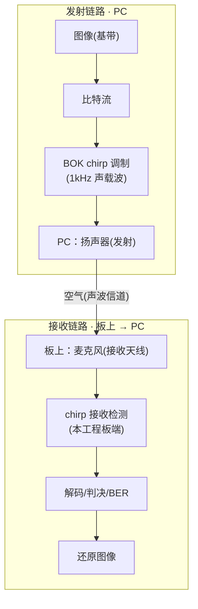
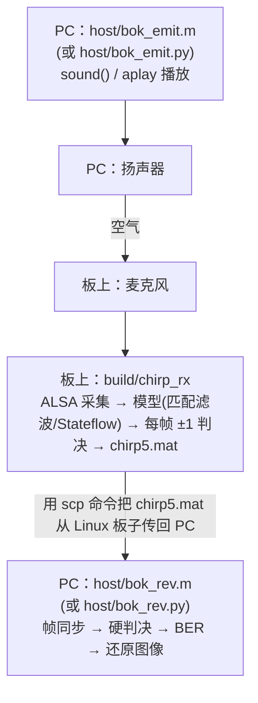

# 实验二 · 线性调频(chirp)扩频通信

把一张 1-bit 图片当基带信息，用 BOK（二进制正交键控）把每个比特调制成上扫/下扫
chirp，经声音载波（1kHz）扬声器发射；开发板麦克风采集，板上做匹配滤波/相关检测，
输出每帧 ±1 判决值；PC 端帧同步、硬判决、算 BER、还原图像。

> 📖 **从零部署到实测的完整分步操作见 [手把手部署运行教程](手把手部署运行教程.md)**（传代码上板 → 编译 → 声学实测 → 取回解码算 BER）。

## 系统模型



- **BOK 调制**：比特 0 → 上扫 chirp(μ=+1)，比特 1 → 下扫 chirp(μ=−1)；
  `cos(2π·fc·t + π·μ·k·t²)`，fc=1000Hz，B=200Hz，T=0.1s/符号，k=B/T，fs=8000Hz，
  每符号 800 样本。
- **接收检测**：用 μ=+1 与 μ=−1 两个匹配滤波器相关，比 `|u1|` vs `|u2|` 出 ±1 判决。
- **板端只输出判决流**，帧同步/解码/BER/还原都在 PC 端（`bok_rev.m` 或 `bok_rev.py`）。

## 数据流



## 目录与文件逐一说明

```
exp2_chirp/
├── Makefile           构建（MODEL/AUDIO 开关）
├── src/  include/      板级运行时 + 契约
├── simulink_model/    改造后的多速率模型 + 生成的 C 代码
├── baseband_images/   基带图片（待传信息）
└── host/              PC 端脚本：MATLAB 发射/解码/仿真 + 免 MATLAB 的 Python 复刻
```

### `src/` + `include/`

| 文件 | 作用 |
|---|---|
| `src/main.c` | 主循环：ALSA 采集 800 样本/帧(10Hz) → 喂模型 → `model_step_frame()` → 取标量判决 → 写 `chirp5.mat`。命令行 `-d/-t/-c/-r`。 |
| `src/model_glue.c` | 耦合 Simulink 符号名的薄层：`chirp_rev_detect_U.AudioIn` 输入、`chirp_rev_detect_Y.out_data` 判决。封装多速率 `step1 + 800×step0`。 |
| `include/model_iface.h` | 契约：`MODEL_FRAME_SAMPLES=800`、`MODEL_FRAME_RATE_HZ=10` 等，`model_step_frame()` 声明。 |

### `simulink_model/` — 模型与生成代码

| 文件 | 作用 |
|---|---|
| `chirp_rev_detect.slx` | 改造后的接收模型（含 15 个 Stateflow，**多速率**）。 |
| `chirp_rev_detect_ert_rtw/*.c/.h` | 生成的纯算法 C（零支持包/零 rt_logging）。 |

**模型改造**：
- `ALSA Audio Capture` → **Inport `AudioIn`**（`int16[1600]` = 800样本×2声道，`[L0..799,R0..799]`）。
- **仅保留** `toFileData5` → **Outport `out_data`**（标量判决值），删除其余 10 个未用 `To File`。
- 配置 `ert.tlc` + `HardwareBoard=None` + `GenCodeOnly` + `MatFileLogging=off` + `Device Type=ARM Cortex-A (64-bit)`。

**多速率（与实验一的关键不同）**：模型双速率——`step0`@8000Hz（逐样本 chirp 相关）、
`step1`@10Hz（每 800 样本一帧，读音频/出判决）。运行时
`model_step_frame()` = `step1()` + `step0()×800`，由 ALSA 阻塞读（800帧@8000Hz=100ms）
提供 10Hz 实时节拍。

### `baseband_images/` — 基带图片

四张 1-bit 位图，逐像素（列优先）展开成比特流当基带信息：

| 文件 | 尺寸(宽×高) | 比特 | 说明 |
|---|---|---|---|
| `ren128b.bmp` | 16×8 | 128 | 默认演示图（最短，18.3s） |
| `lan336.bmp` | 21×16 | 336 | — |
| `ren512b.bmp` | 32×16 | 512 | `bok_sim.m` 纯仿真用 |
| `lzu2048b.bmp` | 64×32 | 2048 | **「兰州大学」字样**（最长，~210s） |

**帧结构（按图片自适应，`L`=图片比特数）**：

```
[0:10]        全 0            静默/信号检测
[10:20]       1010101010      交替前导
[20:35]       m序列(15位)      帧头同步  [1 0 0 1 1 0 1 0 1 1 1 1 0 0 0]
[35:35+L]     图像 L 位        基带载荷
[35+L:50+L]   m序列(15位)      帧尾同步
[50+L:...]    GUARD(5) 个 0    补偿接收 1 符号时延、防帧尾落 EOF 被截
```

两段 m 序列起点间距 = `L+15`，解码端据此自适应定位、并按真实宽高还原点阵。

### `host/` — PC 端 MATLAB 脚本（发射/解码/仿真）

| 文件 | 作用 | 关键数据 |
|---|---|---|
| `bok_emit.m` | 发射：读图（顶部 `img_name` 可切换，默认 `ren128b.bmp`）→ 自适应组帧 → `sound()` 播放 | 写 `info_all.mat` |
| `bok_rev.m` | 解码：读 `chirp5.mat` 帧同步/硬判决/BER/`imshow` 还原 | 读 `chirp5.mat` + `info_all.mat`；`img_name` 须与发送一致 |
| `bok_sim.m` | 纯 MATLAB 端到端仿真（512位 `ren512b.bmp`，无硬件） | 读 `../baseband_images/ren512b.bmp` |
| `setup_paths.m` | 把脚本/图片/模型目录加入 MATLAB 路径 | — |
| `sample_data/` | 一组真实样例 `chirp5.mat`+`info_all.mat`，可离线试解码 | — |

> 路径已全部改为相对脚本自身定位（`here=fileparts(mfilename('fullpath'))`），换目录不会找不到文件；编码统一 UTF-8（原工程 GBK/UTF-8 混编，见 [Q&A](Q&A.md)）。

### `host/` — 免 MATLAB 的 Python 复刻（与上面 `.m` 同名配对）

| 文件 | 作用 |
|---|---|
| `bok_emit.py` | 复刻 `bok_emit.m`：读任意 1-bit BMP（自动宽高、自适应组帧）→ 输出 `chirp_tx.raw/.wav/tx_truth.txt`，并打印声学采集建议 `-t` 秒数。 |
| `bok_rev.py` | 复刻 `bok_rev.m`：从同一 BMP 读尺寸 → 帧同步 → 硬判决 → BER → ASCII 还原图。 |

## 任意图片支持

发射/解码均**按图片尺寸自适应**：帧间距 = 图片比特数+15，按真实宽高还原点阵。
**接收端 C 与 Simulink 模型无需任何改动**——模型符号无关（每 0.1s 符号出一个 ±1 判决），
帧长仅由发射端与采集时长决定。四张图均**文件直喂 BER=0、像素级还原**。
大图 `lzu2048b`(~210s) 声学采集需 `-t` 给足。

## 重新生成模型（改算法后）

两种等价方式，产物都落到 `chirp_rev_detect_ert_rtw/`，任选其一。

### 方式 A：脚本（`slbuild`，可批处理）

```matlab
cd <exp2_chirp/simulink_model>
load_system('chirp_rev_detect')
% …如需改算法在此修改…
set_param('chirp_rev_detect','SystemTargetFile','ert.tlc');
set_param('chirp_rev_detect','HardwareBoard','None');
set_param('chirp_rev_detect','GenCodeOnly','on');
set_param('chirp_rev_detect','MatFileLogging','off');
slbuild('chirp_rev_detect');     % 代码直接生成到 chirp_rev_detect_ert_rtw/
```

### 方式 B：Simulink 界面（GUI，更直观）

GUI 方式就是把上面 `set_param` + `slbuild` 用菜单点出来，产物完全一致。

1. 打开 `chirp_rev_detect.slx`。
2. 顶部 **APPS → Embedded Coder**，工具条出现 **C CODE** 选项卡。
3. `Ctrl+E` 打开 **Configuration Parameters**，对齐下表（与方式 A 一一对应）：

   | 面板 | 选项 | 设成 |
   |---|---|---|
   | Code Generation | System target file | `ert.tlc`（Browse 选 Embedded Coder） |
   | Hardware Implementation | Hardware board | `None` |
   | Hardware Implementation | Device vendor / type | `ARM Compatible` → `ARM Cortex-A (64-bit)` |
   | Code Generation | Language | `C` |
   | Code Generation | ☑ Generate code only | 勾上 |
   | Code Generation → Interface | MAT-file logging | **取消勾选**（否则拖入 `rt_logging.c`，见 [Q&A](Q&A.md)） |

4. **OK / Apply** 保存配置。
5. 模型窗口按 **`Ctrl+B`**（或 **C CODE → Generate Code**）生成，结束后自动弹出
   Code Generation Report 可逐文件查看。

> 本模型含 15 个 Stateflow、且为**多速率**（`step0`@8000Hz + `step1`@10Hz），
> 生成时间比实验一长属正常。生成后若 Inport/Outport 名字变了，同步改
> `src/model_glue.c` 一处即可。

## 构建与运行

```bash
cd exp2_chirp
make                                      # 真实模型 + ALSA（需 libasound2-dev）
make AUDIO=file                           # 真实模型 + 文件输入（无噪声测 DSP）

arecord -l                                # 先看麦克风是 card 几
./build/chirp_rx -d plughw:2,0 -t 28      # card 号按实际改；采集 28 秒
```

产出 `chirp5.mat`（变量 `toFileData5`，2×N：第1行时间，第2行判决值），喂 `bok_rev.m`。

### 复现（两种方式，无需 MATLAB）

```bash
IMG=baseband_images/lzu2048b.bmp          # 换任意图片；缺省 ren128b.bmp

python3 host/bok_emit.py $IMG             # 生成发射信号 + 打印建议 -t

# A) 文件直喂（无声学噪声，纯测 DSP/解码）
make AUDIO=file && ./build/chirp_rx -d chirp_tx.raw

# B) 真实声学（扬声器播放 + 麦克风采集；-t 用建议值）
make && (aplay -q chirp_tx.wav &) ; ./build/chirp_rx -d plughw:2,0 -t 24

python3 host/bok_rev.py $IMG              # 帧同步 + BER + 还原图像
```

### MATLAB 方式（效果等价）

把 `host/bok_emit.m` 与 `bok_rev.m` 顶部 `img_name` 改成同一张图；`bok_emit` 发射、
板上 `chirp_rx` 采集得 `chirp5.mat`、`scp` 回 `host/` 后 `bok_rev` 解码。
离线试解码：把 `sample_data/` 的样例拷到 `host/` 直接跑 `bok_rev`。

## 验证状态 ✅

- 多速率 Stateflow 模型脱离支持包成功生成、零警告编译；实跑 10Hz 正确。
- **文件直喂**四张图 BER=0、像素级还原。
- **真实声学**（扬声器→麦克风）ren128b、兰州大学(2048位) 均 BER=0。
- 三平台实测：**x86 + 树莓派(aarch64) + 香橙派(Ascend310B)**，声学 BER=0。

> 香橙派曾出现"判决恒 −1、帧同步失败"，定位是双声道交织布局差异，已通过
> **默认单声道采集**修复。排错全过程见 [Q&A](Q&A.md)。
