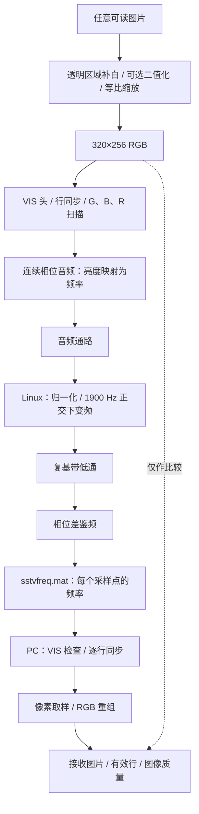
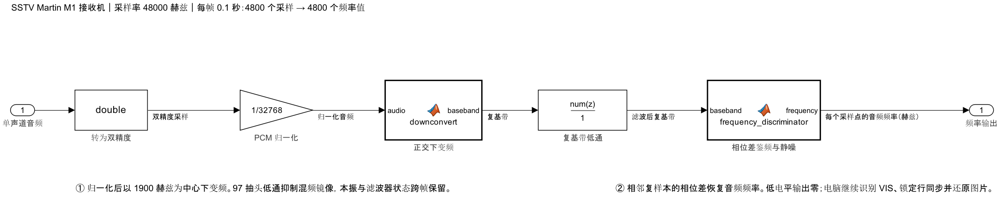

# 实验五 · SSTV Martin M1 图像传输

本实验把图片的像素亮度变成不同频率的音调，按行发送，再从接收音频中恢复图片。默认将输入图片二值化，便于观察黑白边界；关闭二值化后，同一条收发链可以发送彩色图片。

本页解释 Martin M1 的图像扫描、模式识别和鉴频接收。操作见[部署运行教程 · 实验五](手把手部署运行教程.md#实验五)，函数与数据格式见[接口与参数参考](接口与参数参考.md#实验五参数)。

## 从数字比特传输到模拟图像扫描

实验四先把像素打包成比特，再用 QPSK 或 16-QAM 传输。SSTV（慢扫描电视）直接让音频频率表示像素分量的亮度；图像在接收端逐行形成，噪声可能表现为亮度误差、彩色斑点或行错位。

Martin M1 固定为 320×256，每行按绿、蓝、红三个分量依次扫描。即使源图只有黑白两种值，也保留三个分量与完整时序，因此二值化不会缩短传输时间。接收端不需要知道发送图片的内容；本地参考图只用于结果比较。

## 图片如何变成基带信息

GUI 可以选择 MATLAB `imread` 支持的图片。灰度图复制为三个相同分量，调色板图转成 RGB，透明区域与白色背景合成；图片等比缩放后居中补白到 320×256，不强行拉伸长宽比。

默认二值化先计算归一化亮度 `0.2989R + 0.5870G + 0.1141B`，以 0.5 为门限分成黑白，再用最近邻缩放保持二值边界。关闭二值化时使用双线性缩放，保留 RGB 亮度层次。图像分量按从上到下、每行从左到右的顺序扫描。

对一个 0～255 的分量值 \(v\)，音频频率为：

\[
f(v)=1500+800\frac{v}{255}\quad\mathrm{Hz}
\]

黑色对应 1500 Hz，白色对应 2300 Hz，中间亮度位于二者之间。发射端积分频率生成正弦波，各像素之间保持相位连续。二值图的三个分量相同，图像区主要出现 1500 Hz 和 2300 Hz；同步和模式识别仍使用其他音调。

## VIS 头：告诉接收端采用哪一种模式

图像前的 VIS（Vertical Interval Signaling）头先提供引导音，再发送模式编号。Martin M1 的七位编号是十进制 44，按低位先发，并带一位偶校验。

| 顺序 | 音调 | 时长 | 作用 |
|---|---:|---:|---|
| 第一段引导 | 1900 Hz | 300 ms | 识别传输开始 |
| 间隔 | 1200 Hz | 10 ms | 区分两段引导 |
| 第二段引导 | 1900 Hz | 300 ms | 确认引导结构 |
| 起始位 | 1200 Hz | 30 ms | 进入模式字段 |
| 七位模式编号 | 1 为 1100 Hz，0 为 1300 Hz | 每位 30 ms | 编号 44，低位先发 |
| 偶校验 | 同上 | 30 ms | 编号与校验位中的 1 总数为偶数 |
| 停止位 | 1200 Hz | 30 ms | 模式字段结束 |

整个头长 0.910 秒。接收端同时检查引导、间隔、位频率和偶校验；发现其他合法编号会提示当前不支持该模式。VIS 校验只保护模式编号，**不检查后面的图片像素**。

## 一行的时序：为什么一张图约需两分钟

每行先发送同步脉冲，再依次扫描绿、蓝、红分量。1500 Hz 的短间隔把同步与扫描、相邻分量隔开。

| 顺序 | 内容 | 时长 |
|---|---|---:|
| 1 | 1200 Hz 行同步 | 4.862 ms |
| 2 | 1500 Hz 间隔 | 0.572 ms |
| 3 | 绿色分量，320 像素 | 146.432 ms |
| 4 | 1500 Hz 间隔 | 0.572 ms |
| 5 | 蓝色分量，320 像素 | 146.432 ms |
| 6 | 1500 Hz 间隔 | 0.572 ms |
| 7 | 红色分量，320 像素 | 146.432 ms |
| 8 | 1500 Hz 间隔 | 0.572 ms |

每像素占 457.6 µs，每行占 446.446 ms；256 行图像扫描共 114.290176 秒。本实现另加 0.910 秒 VIS 头与 0.100 秒尾音，完整波形约 **115.300 秒**。GUI 默认采集窗口为 `ceil(1 + 115.300 + 2) = 119` 秒。

48 kHz 下每像素约 21.9648 个采样点，不能把每个像素独立四舍五入到 22 点，否则误差会逐行累积。发射端按累计时间确定采样边界，让整幅图的扫描时序保持一致。

时序与 VIS 定义对照 [PySSTV 的 Martin M1 实现](https://github.com/dnet/pySSTV/blob/master/pysstv/color.py)和[公共头编码](https://github.com/dnet/pySSTV/blob/master/pysstv/sstv.py)。本实验只实现 Martin M1 图像收发，不实现其他 SSTV 模式或呼号编码。

## 接收模型：从音频采样恢复频率

`sstv_receive.slx` 每次处理 4800 个单声道 int16 采样点，相当于 48 kHz 下的 0.1 秒。分立模块完成以下处理：

1. **归一化**：把 PCM 值除以 32768。
2. **正交下变频**：乘以 1900 Hz 复本振，使图像频率落在 −400～400 Hz，VIS 与同步也落入复基带。
3. **低通滤波**：97 抽头、1500 Hz 截止频率的 FIR 抑制混频镜像；滤波器与本振状态跨处理帧保留。
4. **相位差鉴频**：对相邻复样本共轭相乘，取相位差并换算回音频频率。

若滤波后复信号为 \(z[n]\)，鉴频公式为：

\[
\hat f[n]=1900+\frac{48000}{2\pi}\arg\{z[n]z^*[n-1]\}
\]

相邻任一样本的包络低于 `1e-5` 时，输出 0 标记不可用频率。该静噪只处理极低电平，不保证有信号时频率一定可信；噪声、混响和削顶仍可能影响鉴频。

模型输出逐采样频率，运行时保存到 `sstvfreq.mat`。模型不接触参考图片，也不负责图片显示；PC 继续执行下面的同步与重组。

## 逐行同步与图片重组

PC 先从鉴频结果识别有效 VIS 44，再根据模式时序预测第一行。每行在预计位置附近搜索 1200 Hz 同步脉冲的结束边沿，并检查脉冲内部的频率，避免把任意图像跳变当作同步。

接收端用相邻行的同步位置持续修正预测，并根据整幅图的行间距估计采样时钟偏差。实际声卡播放与采集时钟不完全一致，如果只按第一行固定计时，误差可能累积成斜图；逐行同步可以重新定位每行起点。当前实现要求估计的行周期偏差在 ±1% 以内。

每个像素在中间 25%～75% 区间取五个插值频率值，以中值映射回亮度，避开像素边界的滤波过渡。接收端按 G/B/R 顺序还原三个分量，并根据同步音估计频偏。没有可靠行同步或采集不完整的行显示灰色，不拿参考图片补齐。

## 如何理解结果

SSTV 图像不带 FCS，因此“已还原 256 行”表示同步与长度条件满足，不等于每个像素都正确。GUI 显示本次发送图、实际还原图、VIS 附近的频率轨迹，以及以下指标：

| 指标 | 含义与限制 |
|---|---|
| 完整行数 | 有行同步且扫描区间完整的行数，最大 256 |
| 二值像素误差率 | 将接收 RGB 均值按 127.5 判成黑白，与本次二值参考图比较；每个有效像素计一次 |
| MAE | 有效行的 RGB 平均绝对误差，取值范围 0～255 |
| PSNR | 按有效行 RGB 均方误差计算的峰值信噪比，峰值取 255；完全一致时为无穷大 |
| 行时钟偏差 | 根据行间距估计的相对偏差，以 ppm 表示 |

二值像素误差率不是 QPSK/16-QAM 的信道 BER，PSNR 也不是音频通路 SNR。缺失行不参与质量计算，因此低误差率必须与完整行数一起看；只收到少数行时，不能据此判断整图可靠。关闭二值化后只显示图像质量，不给彩色像素强行定义二值误差率。

每次开始或解码失败时，GUI 清除旧接收图。采集只覆盖部分图片时会显示本次可恢复的行；VIS 未识别时不显示接收图片。
