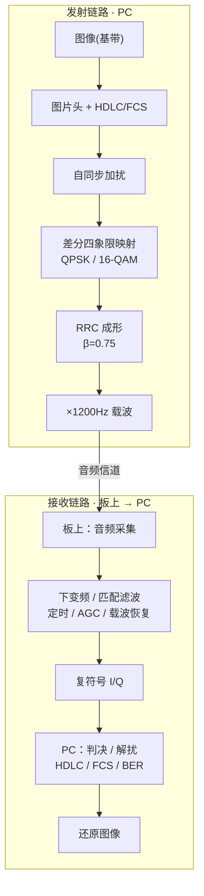
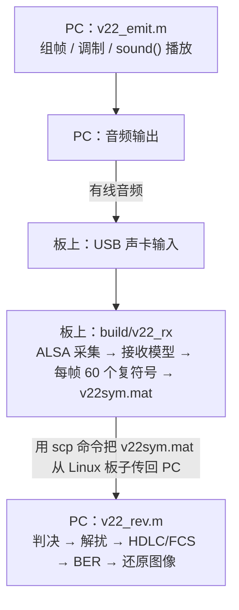
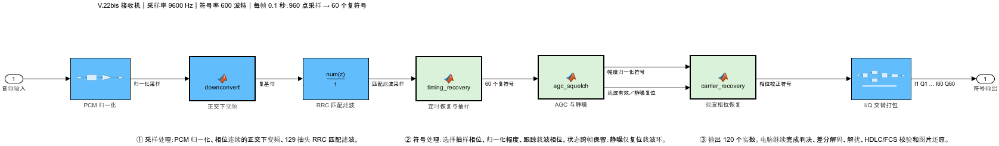

# 实验四 · V.22bis 风格 QPSK/16-QAM 图片传输

把一张 1-bit 图片当基带信息，封装成带 **CRC-16 校验的 HDLC 帧**，经加扰、
差分四象限映射和**平方根升余弦成形**后调制到 1200Hz 载波，从 PC 音频口发射；
开发板采集，板上做下变频、匹配滤波、定时与载波恢复，输出复符号；
PC 端判决、解扰、校验帧、算 BER、还原图像。

> 📖 **从零部署到实测的完整分步操作见 [手把手部署运行教程](手把手部署运行教程.md)**（传代码上板 → 编译 → 收发 → 取回解码算 BER）。

## 系统模型



- **两档调制**：符号率都是 600 baud。2400 bps 使用 16-QAM（4 bit/符号），
  1200 bps 使用 QPSK（2 bit/符号）；前 2 bit 决定相对前一符号的象限旋转，
  16-QAM 另外用 2 bit 选择象限内的点。
- **成形与采样**：采样率 9600Hz，每符号 16 点，RRC 滚降系数 0.75、跨度 8 个符号，
  共 129 抽头；载波 1200Hz，理想占用频带约 675–1725Hz。
- **板端只输出复符号**，两档速率共用一个接收模型；PC 按所选速率继续判决、
  差分解码、自同步解扰、HDLC 解帧与 FCS 校验。发送端与解码端的速率必须一致。

本实验采用 V.22bis 的速率、星座与扰码思路，作为单向突发图片传输教学链路；
未实现完整电话调制解调器的双向握手、全双工和自动速率协商。
已实测的链路为 PC 耳机输出 → USB 声卡输入，空气传播性能尚未验收。

## 数据流



## 目录与文件逐一说明

```
exp4_v22bis/
├── Makefile                 构建入口（MODEL/AUDIO 开关）
├── v22_receive.slx          Simulink 接收模型（只在 PC 上打开）
├── v22_receive_ert_rtw/     模型生成的 C（不入库，Ctrl+B 生成）
├── src/                     手写 C：main.c  model_glue.c  model_iface.h
├── model/                   MATLAB Function 块源文件 + layout.json
├── private/                 收发与协议内部函数，由 MATLAB 自动查找
├── v22_emit.m  v22_rev.m  v22_wav_decode.m  gui.m
├── v22_params.m  build_model.m  setup_paths.m
├── baseband_images/         基带图片（待传信息）
└── tests/                   本机自检、仿真、录音和调试记录（不入库）
```

### `src/` — 板上运行时（手写 C）

| 文件 | 作用 |
|---|---|
| `main.c` | 主循环：ALSA 采集 960 样本/帧(10Hz) → 合并声道 → 喂模型 → `model_step_frame()` → 写 `v22sym.mat`。默认采集单声道；双声道时取左右均值。 |
| `model_glue.c` | **唯一**耦合 Simulink 符号名的薄层：`v22_receive_U.AudioIn` 输入、`v22_receive_Y.symOut` 输出。 |
| `model_iface.h` | 契约：`MODEL_SAMPLE_RATE_HZ=9600`、`MODEL_FRAME_SAMPLES=960`、`MODEL_OUT_LEN=120`，以及 `model_init/step_frame/term` 等声明。 |

（音频 I/O `audio_io*.c`、写盘 `mat_sink.c` 在 `../common/`，见总览。）

### `v22_receive_ert_rtw/` — Simulink 生成的 C

> 这个目录**不在仓库里**，第一次用要先在 MATLAB 里生成（见下面「重新生成模型」）。

| 文件 | 作用 |
|---|---|
| `v22_receive_ert_rtw/*.c/.h` | 生成的纯算法 C（零硬件支持包/零 rt_logging 依赖）。Makefile 与 GUI 直接读取这个目录，无需手动拷贝。 |

**模型接口**（`src/model_glue.c` 按这几个名字取值，改了要同步改那里）：

- 输入：**Inport `AudioIn`**，`int16[960]`，一帧单声道音频。声道合并在 `main.c` 中完成。
- 输出：**Outport `symOut`**，`double[120]`，60 个复符号按 `I1,Q1,I2,Q2,…,I60,Q60` 排列。

**单速率**：一次 `v22_receive_step()` 处理 0.1s 音频，输出 60 个符号。
ALSA 阻塞读（960 样本@9600Hz）提供 10Hz 节拍；载波环的逐符号迭代在模型内部完成。

**代码生成配置**：`ert.tlc` + `HardwareBoard=None` + `GenCodeOnly` + `MatFileLogging=off`
（见 [Q12](Q&A.md)）+ `Device Type=ARM Cortex-A (64-bit)`
+ `Toolchain=Automatically locate an installed toolchain`（见 [Q10](Q&A.md)）。
根 I/O 使用 `Part of model data structure`，与胶水层的 `_U/_Y` 结构体匹配。

### `v22_receive.slx` — 接收处理链



| 模块 | 输入 → 输出 | 作用 |
|---|---|---|
| PCM 归一化 | 960 个 int16 → 960 个 double | 转双精度并除以 32768。 |
| 正交下变频 | 实采样 → 复基带采样 | 1200Hz 本振下变频，相位跨帧连续。 |
| RRC 匹配滤波 | 960 点 → 960 点 | 129 抽头 FIR，与发射成形滤波器匹配，状态跨帧保留。 |
| 定时恢复与抽样 | 960 点 → 60 个复符号 | 累计 16 个候选抽样相位的幅度，以 0.9/0.1 平滑后选择最大者。 |
| AGC 与静噪 | 60 个复符号 → 60 个复符号 + 有效标志 | 按当前帧平均幅度归一化；低于 0.001 门限时输出零。 |
| 载波相位恢复 | 60 个复符号 → 60 个校正符号 | 判决引导二阶环，`Kp=0.05`、`Ki=0.0002`，相位和积分量跨帧保留。 |
| I/Q 交替打包 | 60 个复符号 → 120 个 double | 用标准 Simulink 块分离实虚部、拼接、按列展开。 |

AGC 的有效标志连接到载波恢复模块。静噪帧和重新检测到载波的第一帧会复位载波环；
RRC 与定时平滑状态继续保留。重新初始化模型时，所有状态一起初始化。
两档速率共用当前载波环，其相位检测仍使用 16-QAM 四个第一象限参考点。

模型注释、信号标注和模块显示名称使用中文；内部块路径及 `AudioIn/symOut` 标识保留英文，
便于脚本与生成代码按固定名称访问。

### `model/` — 模型算法源文件

| 文件 | 作用 |
|---|---|
| `downconvert.m` | 正交下变频及连续本振相位。 |
| `timing_recovery.m` | 候选抽样相位累计、平滑与符号抽取。 |
| `agc_squelch.m` | 逐帧幅度归一化与静噪标志。 |
| `carrier_recovery.m` | 判决引导载波相位环及静噪复位。 |
| `layout.json` | 顶层模块位置、注释位置和连线路径；`build_model` 重建时复用。 |

`build_model.m` 读取这些源文件，嵌入对应的 MATLAB Function 块，并将参数存入模型工作区。
**`model/` 不需要加入 MATLAB 路径**；保存后的 `.slx` 已包含块代码和数值参数。

### `baseband_images/` — 基带图片

| 文件 | 尺寸(宽×高) | 比特 | 说明 |
|---|---|---|---|
| `ren512b.bmp` | 32×16 | 512 | 默认演示图 |
| `da512b.bmp` | 32×16 | 512 | — |
| `lan512b.bmp` | 32×16 | 512 | — |
| `ru512b.bmp` | 32×16 | 512 | — |
| `yi512b.bmp` | 32×16 | 512 | — |
| `lzu2048b.bmp` | 64×32 | 2048 | 最长 |

**帧结构**：

```
图片载荷 = 0x22 | 每符号比特数 | 宽 | 高 | 图片字节
           1 B       1 B       1 B  1 B   ceil(宽×高/8) B
HDLC 帧  = 0x7E | 位填充(图片载荷 + FCS-16) | 0x7E
调制输入 = 前导(300 符号的全 1) | HDLC 帧 | 后导(120 符号的全 1)
```

图片按**列优先**展开，每 8 bit 打包一字节，不足补零；字节内**低位先发**。
FCS 使用 CRC-16/X.25，低字节先发；载荷与 FCS 连续出现 5 个 1 后插入一个 0，
首尾 `0x7E` 标志不参与位填充。前导、HDLC 帧和后导一起经过自同步扰码器
`1 + x^-14 + x^-17`，再做差分映射和成形。

前导约 0.5s，用于 AGC、定时和载波捕获；后导约 0.2s，让有效数据通过接收流水线后
再结束载波。**CRC 只检错，不纠错，也没有自动重传**；解码成功要求图片帧通过 FCS。

### PC 端 MATLAB 脚本

| 文件 | 作用 | 关键数据 |
|---|---|---|
| `v22_emit.m` | 发射：读图 → HDLC 组帧 → 加扰/调制 → `sound()` 播放；顶部 `img_name`、`RATE` 可改 | 默认 `ren512b.bmp`、2400 bps；同时写 `v22_tx.raw/.wav` |
| `v22_rev.m` | 解码：读板上符号 → 判决/解扰/HDLC/FCS → BER、图片和星座图 | 读 `v22sym.mat`；`RATE` 与发送一致，`img_name` 仅作 BER 对照 |
| `v22_wav_decode.m` | 直接解一段 WAV：重采样、定位突发、离线解调、还原图片矩阵 | 命令窗口设置 `WAV`、`RATE`；可用 `IMG_NAME` 指定对照图 |
| `gui.m` | **一键实测图形界面**（可选）：自检 → 同步源码并编译 → 电平校准 → 板上采集/本机放音/取回/解码。见[手把手教程 §6](手把手部署运行教程.md#6-用图形界面-guim-一键跑四个实验通用)。 | 选择图片、速率、采集设备和输出设备 |
| `v22_params.m` | 发射、解码与建模使用的统一物理层参数 | `v22_params(2400)` 或 `v22_params(1200)` |
| `build_model.m` | 从 `model/` 源文件和布局配置重新建立接收模型 | 默认保存为 `v22_receive.slx`；可指定另一个 `.slx` 路径 |
| `setup_paths.m` | 配置实验根目录和 `common/matlab` 搜索路径 | 不递归添加 `private/`、`model/` 或 `tests/` |

GUI 左上显示发送点阵、左下显示接收点阵，右侧为星座图。新任务或解码失败会清除旧结果。
星座默认显示**有效图片帧的实际接收符号**，也可切到全部接收符号查看捕获过程；
I/Q 等比例、原点居中，理想参考点与实际接收点分开绘制。BER 是有效图片与参考图的像素误码比例，
解不出有效帧时显示失败，不显示 BER=0。

### `private/` — 收发与协议内部函数

| 文件 | 作用 |
|---|---|
| `v22_img2payload.m` / `v22_payload2img.m` | 图片与带宽高信息的字节载荷互转。 |
| `v22_pack.m` / `v22_unpack.m` | HDLC 组帧/解帧、位填充/去填充、帧边界与 FCS 检查。 |
| `v22_crc16.m` | CRC-16/X.25 校验。 |
| `v22_mod.m` / `v22_demod.m` | 通带调制与 MATLAB 离线解调。 |
| `v22_symbols_to_bits.m` | 板上或模型输出符号的判决、差分解码、自同步解扰。 |
| `v22_prepare_recording.m` | 重采样、按带内能量定位一个突发并裁剪，保留前后余量。 |

这些函数由根目录入口调用，**不要把 `private/` 加入搜索路径**。
录音定位中的带通仅用于检测能量，送入解调器的仍是原始裁剪波形；接收链本身已有 RRC 匹配滤波。
离线解调与板上模型的定时、AGC 策略不同，适合对照排查，不能视为逐符号数值相同的两份实现。

### `tests/` — 本机调试文件（不入库）

自检、模型验证、信道仿真、录音、缓存和测试记录集中放在这里，日常收发不依赖这个目录。
本机保留测试脚本时，可在实验根目录运行 `addpath('tests'); v22_run_tests` 做离线验证；
不要递归添加整个 `tests/`，其中可能包含历史源码副本。

## 任意图片支持

发射端接受**只含 0/1 的单通道二值 BMP**，宽、高各用一个字节存储，最大 255×255。
接收端从载荷头恢复真实尺寸，HDLC 标志确定帧边界；`img_name` 只用于对照和计算 BER，
不用于猜测接收帧长度。**换图不需要改接收端 C 或 Simulink 模型**，但必须给足采集窗口。

换图时将手动收发脚本顶部 `img_name` 改成同一张图、`RATE` 改成同一档；
GUI 中直接选择图片和速率。信号时长包括前导、后导、位填充和滤波拖尾，
应采用脚本打印的建议 `-t` 或 GUI 计算的采集窗口，不能只用图片比特数除以速率。

## 构建与运行

以下在开发板的 `exp4_v22bis/` 目录执行；第一次使用先生成并上传模型 C：

```bash
cd exp4_v22bis
make                                      # 真实模型 + ALSA（需 libasound2-dev）

arecord -l                                # 先看声卡是 card 几
./build/v22_rx -d plughw:2,0 -t 7         # 默认图片示例；card 号与时长按实际改
```

产出 `v22sym.mat`（变量 **`v22Sym`**，121×N double：第 1 行时间，其余 120 行为交替 I/Q），
喂 `v22_rev.m`。本实验使用 **9600Hz**；声卡不支持该硬件采样率时，使用 `plughw` 由 ALSA 重采样。

> 设备名 `-d`、单声道默认 `-c 1` 等问题统一见 [Q&A](Q&A.md)。先启动板上采集，再到 PC 放音。

### 在 PC 上用 MATLAB 跑

把 `v22_emit.m` 与 `v22_rev.m` 顶部 `img_name`、`RATE` 配成一致。
在 PC 的 `exp4_v22bis/` 中运行 `setup_paths`、`v22_emit`；板上采集结束后取回数据：

```bash
scp <用户>@<板子IP>:~/portable-acoustic-sdr/exp4_v22bis/v22sym.mat .
```

再运行 `v22_rev` 解码。也可运行 `gui`，按自检、同步编译、校准、实测四步操作。
连接时确认实际输出设备，先校准电平再传图；关闭声卡混响、变声等音效，避免过载削顶。
手动发射脚本的播放增益与 GUI 幅度独立，不能将界面中校准好的幅度当作脚本设置。

### 文件直喂（无需声卡采集）

`v22_emit` 默认另存 `v22_tx.raw/.wav`。将 `.raw` 传到板上的实验目录，再执行：

```bash
make AUDIO=file BUILD=tests/artifacts/build-file
./tests/artifacts/build-file/v22_rx -d v22_tx.raw
```

输入必须是 **9600Hz、单声道、16 位小端 PCM**，不带 WAV 头。输出仍是 `v22sym.mat`，
取回后按相同速率运行 `v22_rev`。文件后端单独放在 `tests/`，避免与正式 ALSA 构建混用。

### 直接解 WAV 录音

```matlab
WAV = '你的录音.wav';
RATE = 2400;                 % 与发送端一致
IMG_NAME = 'ren512b.bmp';     % 可选，仅用于误像素对照
v22_wav_decode
```

脚本自动重采样到 9600Hz，定位一个突发并解码，成功时还原图片矩阵 `im`。
它不自动拆分同一录音中的多次发送；若未找到通过 FCS 的图片帧，会打印失败结果。

## 重新生成模型（改算法后）

实验四当前模型在 **R2025b** 上构建和验证，尚未验证 R2022a 导出兼容性。
以下两种方式都从当前 `.slx` 生成 `v22_receive_ert_rtw/` 中的 C，任选其一。

### 方式 A：脚本（`slbuild`，可批处理）

```matlab
R = '<仓库根目录>';
% ★ 先切到实验目录，让默认代码生成目录落在这里。
cd(fullfile(R,'exp4_v22bis'));
setup_paths
load_system('v22_receive')
set_param('v22_receive','SystemTargetFile','ert.tlc');
set_param('v22_receive','HardwareBoard','None');
set_param('v22_receive','GenCodeOnly','on');
set_param('v22_receive','MatFileLogging','off');
set_param('v22_receive','Toolchain','Automatically locate an installed toolchain');
set_param('v22_receive','RootIOFormat','Part of model data structure');
slbuild('v22_receive');       % 生成到 v22_receive_ert_rtw/
% 想无条件重新生成，加 'ForceTopModelBuild',true
```

### 方式 B：Simulink 界面（GUI，更直观）

> ⚠️ **动手前先把 MATLAB 的当前文件夹切到 `exp4_v22bis/`**，避免生成代码落到别处，板上仍在编旧文件。

打开 `v22_receive.slx` → **APPS → Embedded Coder** → `Ctrl+E` 对齐上述参数
（完整配置表见[实验三文档](实验三_chirp扩频.md#方式-bsimulink-界面gui更直观)）→ `Ctrl+B` 生成。

生成后用 GUI“同步源码到板上并编译”，或按部署教程上传后 `make`。
`.m`、`.slx` 只在 PC 上使用，不需要传到板上；若改变 Inport/Outport 名字，同步改 `src/model_glue.c`。

### 从源文件重建模型

改 `model/*.m` 或 `v22_params.m` 后，先在实验目录执行 `build_model`，再执行上述代码生成步骤。
`build_model` 会重建并保存 `.slx`；若存在未保存的模型编辑，会提示先保存或另存。

直接在 Simulink 中改了算法块，应将修改回写到对应 `model/*.m`；
手动调整模块间距或连线后，应同步更新 `model/layout.json`，否则下次重建会恢复配置中的布局。
需要保留当前模型时，可用 `build_model(另一个slx文件的完整路径)` 建立副本。
