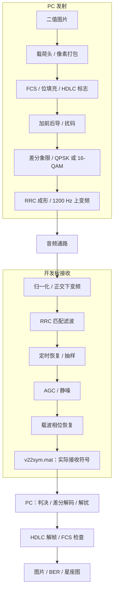

# 实验四 · V.22bis 风格的 QPSK / 16-QAM 图片传输

本实验把二值图片封装成带校验的帧，通过 QPSK 或 16-QAM 调制成音频。开发板完成匹配滤波、定时恢复、幅度归一化和载波相位恢复，输出实际接收符号；PC 再判决比特、检查帧并还原图片。

本页沿信号流解释原理。首次操作见[部署运行教程 · 实验四](手把手部署运行教程.md#实验四)，参数和数据格式见[接口与参数参考](接口与参数参考.md)，改模型后的流程见[构建与部署](构建与部署.md#重建实验四模型)。

## 实验与 V.22bis 标准的关系

[ITU-T V.22bis](https://www.itu.int/rec/T-REC-V.22bis-198811-I/en) 定义了电话线路上的分频双工 modem。本实验采用其中的 600 Baud、1200/2400 bps 调制思路、差分象限编码和主叫方向的 1200 Hz 载波，用于单向图片突发传输。

工程没有实现完整的双工呼叫握手、速率协商和自适应信道均衡，图片载荷与 HDLC 封装也由本工程定义。因此这里的“V.22bis 风格”说明物理层来源，不代表完整标准兼容或可以直接与电话 modem 互通。

## 系统模型

## 两档速率：每个符号装多少比特

两档的符号率均为 600 Baud，差别在于每个符号所能选择的点数：

| 档位 | 星座点数 | 每符号比特数 | 比特率 |
|---|---:|---:|---:|
| QPSK | 4 | 2 | 600 × 2 = 1200 bps |
| 16-QAM | 16 | 4 | 600 × 4 = 2400 bps |

QPSK 主要用相位区分四个点；16-QAM 同时利用幅度和相位，在相同符号率下携带更多信息。16-QAM 的判决更依赖幅度尺度和点间距离，因此 AGC、失真和噪声对它更敏感。图片有效吞吐率还要扣除帧头、校验、位填充以及前后导开销，不能直接等同比特率。

## 组帧：让接收端知道图片在哪里

图片必须是只含 0/1 的单通道二值 BMP。像素按列优先展开，每 8 bit 打包成一个字节，不足补零；宽、高各占一个字节，最大 255×255。

图片载荷按下表从上到下的顺序组成，B 表示字节：

| 字段 | 长度 | 内容 |
|---|---|---|
| 类型标识 | 1 B | 固定为 `0x22`，标识实验四的图片载荷 |
| 每符号比特数 | 1 B | QPSK 为 `2`，16-QAM 为 `4` |
| 宽 | 1 B | 图片列数 |
| 高 | 1 B | 图片行数 |
| 图片字节 | `ceil(宽×高/8)` B | 按列优先展开并打包的像素 |

载荷再封装为 HDLC 帧，并加入前后导。下表箭头表示各部分的发送顺序：

| 层级 | 组成（从左到右） |
|---|---|
| HDLC 帧 | `0x7E` → 位填充（图片载荷 + FCS-16）→ `0x7E` |
| 调制输入 | 前导 → HDLC 帧 → 后导 → 凑整符号所需的补位 |

字节内低位先发。FCS 使用 CRC-16/X.25：多项式 `0x1021`，反射实现为 `0x8408`，初始值和最终异或值均为 `0xFFFF`，低字节先发。载荷和 FCS 中每连续出现 5 个 1，就插入一个 0；接收端先定位 `0x7E`，再去填充并校验，标志本身不参与填充。

与实验二、三不同，接收端从载荷头取得宽高，不依赖参考图片猜帧长。参考图片仅用于 BER 对照。CRC 负责检错，不负责纠错；工程没有自动重传，无法恢复有效帧时应报告失败。

## 前后导与扰码：帮助接收机进入稳定状态

前导为 300 符号，即 0.5 秒；后导为 120 符号，即 0.2 秒。二者进入扰码器前都是全 1 比特，扰码后成为变化的符号序列，为 AGC、定时和载波恢复提供捕获时间。后导让有效数据通过接收流水线后再结束载波。

设扰码器输入为 $b_i$、输出为 $c_i$，初始寄存器全零：

$$
c_i=b_i\oplus c_{i-14}\oplus c_{i-17}.
$$

接收端根据当前和延迟的接收比特做同样的异或，恢复 $b_i$。这是自同步扰码：它改善输入序列的统计特性，既不是加密，也不增加纠错能力；单个传输错误还可能影响多个解扰输出比特。

GUI 的“前导余量”是**启动采集后、开始播放前的等待时间**，不属于上述调制前导。“尾部余量”是采集窗口在完整波形之外的预留时间，也不是后导符号。

## 差分象限映射：解决象限基准问题

每个符号的前两比特决定相对于上一符号的象限旋转量：

| 前两比特 | `00` | `01` | `10` | `11` |
|---|---:|---:|---:|---:|
| 旋转量 | 90° | 0° | 180° | 270° |

设前一符号的象限角为 $q_{k-1}$，则 $q_k=(q_{k-1}+\Delta q_k)\bmod360^\circ$。QPSK 在第一象限只有参考点 $(1+j)/\sqrt2$，乘上 $e^{j\pi q_k/180}$ 后得到四点星座。

16-QAM 用后两比特选择第一象限的点，再旋转到相应象限：

| 后两比特 | `00` | `01` | `10` | `11` |
|---|---|---|---|---|
| 第一象限点 | `1+j` | `3+j` | `1+3j` | `3+3j` |

接收端比较相邻符号的象限变化，恢复前两比特。共同的 90° 整数倍旋转在差分中抵消，但任意残余相位误差仍会压缩判决余量，因此差分映射不能代替载波同步。

## RRC 成形与匹配滤波

采样率为 9600 Hz，每符号正好 16 点。发送端将复符号上采样，经滚降系数 0.75、跨度 8 符号的 RRC 滤波器成形，再上变频取实部：

$$
s[n]=\sum_k a_kh[n-16k],\qquad
x[n]=\Re\{s[n]e^{j2\pi1200n/9600}\}.
$$

滤波器有 $8\times16+1=129$ 个抽头。接收端下变频后使用匹配的 RRC，抑制带外噪声并使收发级联接近升余弦响应；有限长度滤波器仍有截断误差。其设计与级联关系可参阅 [MathWorks 的 RRC 说明](https://www.mathworks.com/help/signal/ref/rcosdesign.html)。

理想成形下，复基带单边带宽为 $(1+0.75)\times600/2=525$ Hz，对应正频率通带约 675～1725 Hz。额外带通可以针对带外干扰，但不能恢复已经削顶、丢失的样本，也不能替代对带内混响的均衡。

## 板上接收链：从采样点到复符号

模型每次处理 960 点，即 0.1 秒音频，并输出 60 个复符号。各模块用途如下：

| 模块 | 处理内容 | 跨帧状态 |
|---|---|---|
| PCM 归一化 | `int16` 转双精度并除以 32768 | 无 |
| 正交下变频 | 乘连续的 1200 Hz 复本振，移到基带 | 本振相位 |
| RRC 匹配滤波 | 129 抽头复基带 FIR | 滤波延迟线 |
| 定时恢复与抽样 | 比较 16 个候选采样位置，每帧抽出 60 个符号 | 各候选位置的平滑幅度和 |
| AGC 与静噪 | 按帧平均幅度归一化，低于门限时输出零 | 当前帧决定增益 |
| 载波相位恢复 | 按速率选择参考点，逐符号校正残余相位 | 相位、积分量和捕获状态 |
| I/Q 交替打包 | 实虚部分离后按 `I1,Q1,…,I60,Q60` 输出 | 无 |

定时模块计算每个候选位置的幅度和，用 `0.9 × 旧值 + 0.1 × 新值` 平滑，选择最大者。它是整数采样相位选择器，没有分数延迟插值或完整的采样时钟跟踪环，长突发或较大时钟偏差下有局限。

AGC 的目标平均幅度为 QPSK 的 1，或 16-QAM 的约 2.99535。静噪门限为 0.001，作用于匹配滤波、抽样之后的帧平均幅度，不是原始 PCM 的 RMS 门限。两档接收速率必须与发送一致。

载波环先校正当前符号，再用对应星座的最近参考点产生相位误差：

$$
z_k=y_ke^{-j\hat\theta_k},\quad
 e_k=\arg(z_k\hat a_k^*),\quad
 I_k=I_{k-1}+K_i e_k,\quad
 \hat\theta_{k+1}=\hat\theta_k+K_p e_k+I_k.
$$

其中 $K_p=0.05$、$K_i=0.0002$。QPSK 每个象限只使用对角线参考，16-QAM 使用四个象限内参考点；把 QPSK 当成 16-QAM 鉴相可能错误锁定。静噪、重新捕获或切换速率会复位载波环，RRC 和定时平滑状态继续保留；重新初始化模型才会清空全部状态。

模型显示注释、模块名称和信号标注使用中文，`AudioIn`、`RxRate`、`symOut` 等程序接口保留固定英文标识。模型源文件与布局的关系见[实验四目录](接口与参数参考.md#实验四内部文件)。

## 解码与星座图分别说明什么

PC 将 `v22sym.mat` 的 I/Q 数据还原成复符号，依次执行星座判决、差分象限解码、解扰、HDLC 解帧和 FCS 检查。有效载荷中的宽高和像素用于还原图片，参考图匹配时计算像素 BER。

GUI 的两项 BER 使用不同的筛选条件：

| 指标 | 计算条件与含义 |
|---|---|
| BER | FCS 通过、图片可还原且尺寸与参考一致，比较图片比特；坏帧不参与，所以常见结果是零误码或未解出帧 |
| 校验前图片 BER | 不按 FCS 筛选，但要求完整 HDLC 边界、合法去填充、四字节图片头和载荷长度与参考一致，且匹配候选唯一；只比较图片比特，不含帧头、FCS、填充位和前后导 |

校验前图片 BER 仅用于诊断，不能替代 FCS。即使该值为零，FCS 字节本身损坏仍会使整帧失败；图片有误码而 FCS 失败时，也不会显示成成功接收的图片。边界、格式、图片头、长度不满足条件或候选不唯一时，显示无法计算，不通过搜索最小误码位置强行对齐。

“接收状态”和日志分别报告帧标志数量、过短区间、位填充非法、长度异常、FCS 失败和图片格式错误。检测到 `0x7E` 只代表发现候选边界，误码也可能制造假标志，不能据此断言帧同步正确；这些结果也不能单独区分载波恢复、抽样定时和信道失真的根因。

本窗口按 QPSK、16-QAM 分别累计有效图片帧成功率和帧错误率，可用“清零统计”重新开始。分母是已取回且符号数据格式有效的实采次数；FCS 通过并可还原图片计成功，其他解码结果（含全零符号）计失败。有效帧成功率不要求参考图片 BER 为零。仅解码旧文件、校准、取消，以及连接、采集进程或文件异常不计入；统计不跨窗口保存，也不会在重复解码时增加。

GUI 左侧上下显示发送点阵和接收点阵，右侧显示星座。新任务或解码失败会清除旧结果；失败不是 BER=0。默认星座只画有效图片帧对应的**实际接收点**，切换到全部符号可以检查前导捕获、静噪和异常过程。

坐标轴以原点为中心、I/Q 等比例显示，不会把每次数据的均值强制移到零，也不会把接收点吸附到理想点。BER=0 说明这一有效图片与参考图一致，不说明前导也已稳定，更不等于所有发送均成功；评估链路时还需记录失败次数和重复发送情况。

直接 WAV 解码使用独立的离线定时与 AGC 策略，适合交叉排查，但不与板上模型逐符号等价。录音定位中的带通只用于检测突发能量，实际解调输入仍是裁剪后的原始波形；操作见[直接解 WAV](构建与部署.md#直接解-wav)。
